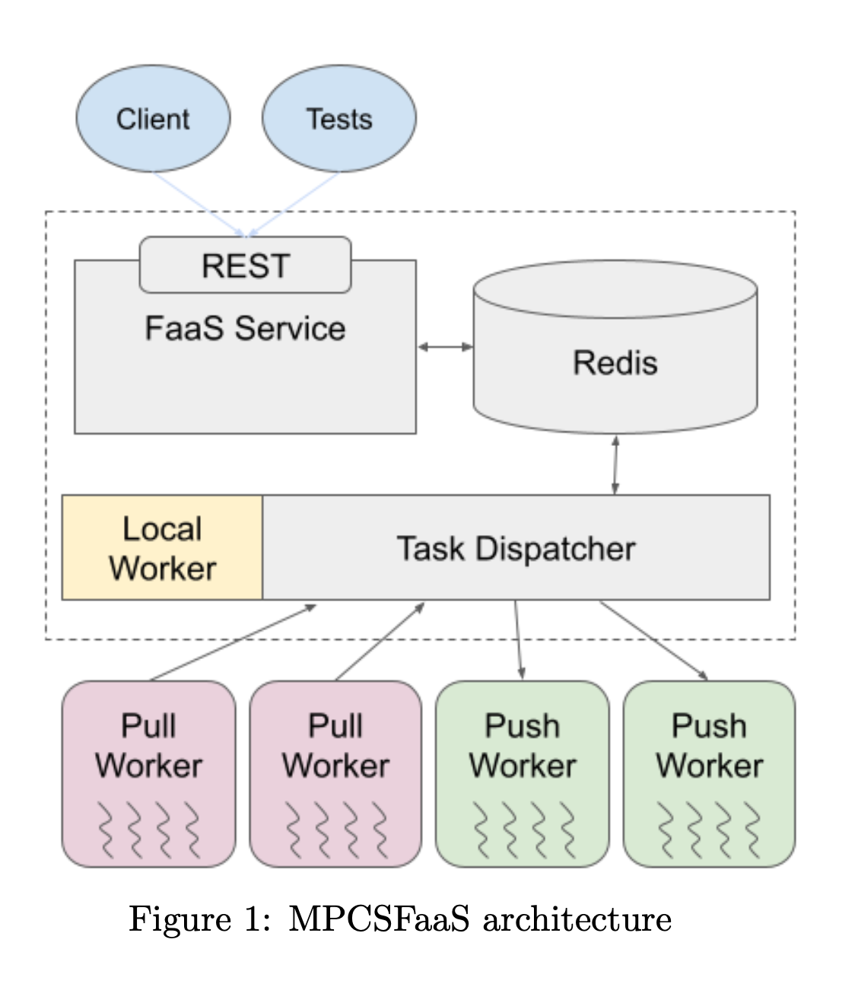

# Technical Report: Function-as-a-Service (FaaS) Platform

**Authors:** Akshat Singhania & Linn Oberbeck  
**Date:** December 3 2025


## Executive Summary

This report describes the design and implementation of a distributed Function-as-a-Service (FaaS) platform that supports three execution modes: **Local**, **Pull**, and **Push**. The system enables users to register Python functions, execute them asynchronously on remote workers, and retrieve results through a RESTful API. The platform implements robust fault tolerance mechanisms including heartbeat-based failure detection, deadline tracking, and comprehensive error handling.

**Key Features:**
- RESTful API for function registration and execution
- Three dispatcher modes (Local, Pull, Push) for different workload patterns
- Redis-backed persistent storage for tasks and functions using Pub-Sub model
- ZeroMQ-based worker-dispatcher communication
- Fault-tolerant worker management with failure detection [using fixed intervals and heartbeat checks]
- Serialization-based function and result transmission using Dill

---

## System Architecture

{width=50%}

### High-Level Overview

The FaaS platform consists of five main components:

### Component Descriptions

#### 1. **Client** (`client_faas.py`)
A command-line tool that lets users submit functions and arguments. It serializes the function, sends it to the server via HTTP, and polls for results.

#### 2. **Server** (`server_faas.py`)
- A FastAPI REST API that handles incoming requests. When a user registers a function, the server stores it in Redis. When they execute a function, the server creates a task and notifies the dispatcher through Redis pub/sub.

**Key Endpoints:**
- `POST /register_function/` - Register a serialized function
- `POST /execute_function/` - Submit a task for execution
- `GET /result/{task_id}` - Retrieve task status and result

#### 3. **Dispatcher** (`task_dispatcher.py`)
The dispatcher routes tasks to workers in three differently implemented modes:
  - **Local**: Uses multiprocessing.Pool for immediate execution (baseline)
  - **Pull**: Workers request tasks (REQ/REP pattern)
  - **Push**: Dispatcher pushes tasks to workers (DEALER/ROUTER pattern)
It tracks task and worker states, as well as worker failures

#### 4. **Workers** (`pull_workers.py`, `push_workers.py`)
They execute tasks inside isolated processes using a multiprocessing.Pool and communicate with the dispatcher over ZeroMQ, either sending heartbeats in Push mode or requesting work in Pull mode. Once they have results, these get sent back to the dispatcher for final status updates.

#### 5. **Redis**
Stores all the function code, task metadata, and results. It also acts as a message broker between the server and dispatcher.
- Key structure:
  - `{function_id}` → Function payload
  - `task:{task_id}` → Task metadata, status, and result

---

## Implementation Details

### Serialization
Python functions and arbitrary objects need to be transmitted over the network.
We therefore use Dill, an extension of Python's pickle that can serialize lambda functions, closures, and complex objects.
As provided in the project description code, the Base64 encoding ensures safe transmission through JSON and Redis.

### Communication Protocols

#### HTTP
### Between Client and Server
Communication between the client and server is handled through a simple RESTful API built with FastAPI, using JSON request and response bodies that contain base64-encoded function payloads. The system operates synchronously for clarity, and the client polls the server to retrieve task results.

#### Redis Pub/Sub
### Between Server and Dispatcher
Communication between the server and the dispatcher is handled through Redis Pub/Sub. After the server stores a task in Redis, it publishes the task ID to the tasks channel, which the dispatcher is subscribed to. This setup fully decouples the server from the dispatcher and even allows multiple dispatchers to listen for and process tasks independently.

#### ZeroMQ
### Between Dispatcher and Workers

**Pull Mode (REQ/REP)**:
In Pull Mode, workers actively request work from the dispatcher. Each worker begins by sending a PULL_REQUEST message containing its worker ID. The dispatcher replies with either a TASK message that includes the serialized function and arguments, or a NO_TASK message if no work is available. Once a worker completes a task, it returns the outcome to the dispatcher using a PULL_RESULT message, after which the dispatcher confirms receipt by sending back an ACK.

**Push Mode (DEALER/ROUTER)**:
In Push Mode, each worker begins by sending a REGISTER message when it starts up so the dispatcher knows it exists. Workers then continue sending periodic HEARTBEAT messages so the dispatcher can track which ones are alive and available. The dispatcher proactively pushes TASK messages to any worker marked as available, rather than waiting for a request. After completing a task, the worker responds with a PUSH_RESULT message so the dispatcher can record the outcome and free the worker for new work.

### Task State Management

Tasks transition through the following states:

```
QUEUED → RUNNING → COMPLETE/FAILED
```

**State Transitions:**
1. **QUEUED**: Task created and stored in Redis, waiting for worker
2. **RUNNING**: Dispatcher assigned task to worker
3. **COMPLETE**: Worker successfully executed function and returned result
4. **FAILED**: Function raised exception or worker failed during execution

### Worker Argument Handling
Function arguments may be passed as single values, tuples, or dictionaries, which means the worker cannot assume a fixed structure. To solve this, workers implement intelligent argument unpacking: if the payload is a tuple, it is expanded with fn(*args); if it is a dictionary, it is applied with fn(**args); otherwise, the worker treats it as a single positional argument and calls fn(args).

```python
if isinstance(args, tuple):
    result = fn(*args)
elif isinstance(args, dict):
    result = fn(**args)
else:
    result = fn(args)  # Single argument
```

This handles all common argument patterns without requiring the client to specify argument types.

---

## Fault Tolerance & Error Handling

Distributed execution introduces two major categories of failure, and the system handles each one differently to keep the platform robust and predictable.


#### 1. **Task Failures** (Function Errors)
A user-defined function may raise an exception during execution, for example, due to invalid input, a runtime error, or unexpected behavior inside the function body. To capture this safely, workers wrap function calls in a try/except block. If the function raises an exception, the worker serializes the full error information (type, message, and traceback) and returns it as a "FAILED" result instead of crashing.
This ensures that the client receives meaningful debugging information while the worker remains operational.

**Implementation:**
```python
try:
    result = fn(args)
    return ("COMPLETE", serialize(result))
except Exception as e:
    error_info = {
        "type": type(e).__name__,
        "message": str(e),
        "traceback": traceback.format_exc()
    }
    return ("FAILED", serialize(error_info))
```

#### 2. **Worker Failures** (Infrastructure Errors)
Workers themselves may fail. Examples include crashes, network disconnects, hangs, or being killed by the OS. Since a worker may stop responding mid-task, both dispatcher modes include infrastructure-level failure detection.

Pull Mode uses a deadline approach: every dispatched task has a start timestamp, and a background checker periodically scans for tasks that have exceeded the configured execution deadline. Any overdue task is automatically marked as "FAILED" due to worker failure.

Push Mode uses heartbeats: workers periodically send HEARTBEAT messages to announce that they are still alive. If a worker stops sending heartbeats for longer than the configured timeout, the dispatcher considers the worker dead. If that worker had an active task, the dispatcher marks the task as "FAILED" and frees the system to continue processing.

**Pull Mode Implementation** (Deadline-based):
```python
def _deadline_checker(self):
    while self.running:
        time.sleep(1)
        current_time = time.time()
        
        for task_id, task_info in list(self.pending_tasks.items()):
            if current_time - task_info.start_time > self.deadline:
                self.redis.update_task_result(
                    task_id,
                    TaskStatus.FAILED,
                    serialize(f"WorkerFailure: Task exceeded deadline")
                )
```

**Push Mode Implementation** (Heartbeat-based):
```python
def _heartbeat_checker(self):
    while self.running:
        time.sleep(HEARTBEAT_CHECK_INTERVAL)
        current_time = time.time()
        
        for worker_id, info in self.workers.items():
            if current_time - info.last_heartbeat > self.heartbeat_timeout:
                # Mark worker as dead and fail its current task
                if info.current_task:
                    self.redis.update_task_result(
                        info.current_task,
                        TaskStatus.FAILED,
                        serialize(f"WorkerFailure: Worker {worker_id} failed")
                    )
```

---

### HTTP Error Codes

The server implements comprehensive error handling with appropriate HTTP status codes, for easier testing and debugging, as well as a better user experience.:

| Error Type | HTTP Code | Example |
|-----------|-----------|---------|
| Invalid input | 400 Bad Request | Malformed UUID, empty payload |
| Resource not found | 404 Not Found | Task/function doesn't exist |
| Server error | 500 Internal Server Error | Redis failure, deserialization error |
| Service unavailable | 503 Service Unavailable | Redis connection down |

### Design Decisions

Heartbeats set at 200 ms allow the system to detect worker failures in well under a second, enabling rapid recovery. This interval is short enough to provide fast responsiveness while still light enough that the overhead remains negligible, roughly five small heartbeat messages per second per worker. As a result, the dispatcher can quickly identify dead workers and reassign their tasks without noticeably impacting system performance.

---

## Limitations & Future Work

### Current Limitations

#### 1. **Scalability**
The architecture relies on a single FastAPI server, creating a clear single point of failure and limiting throughput. All task and function metadata is stored in a single Redis instance, which becomes a bottleneck as load increases. Moreover, the system lacks proper load balancing, meaning tasks cannot be effectively distributed across multiple dispatchers, further restricting horizontal scalability.


#### 2. **Serialization Constraints**
Dill cannot serialize every type of Python object, such as open file handles or active threads, and large function closures can significantly increase payload size and transmission time. Additionally, the system does not validate serialized payloads before execution. As a result, users may encounter unclear or cryptic serialization-related errors when submitting certain functions.


#### 3. **Security**
There is no authentication layer, meaning anyone with access to the service can submit arbitrary code for execution. Because deserialized functions run with full system privileges, this creates a significant code-injection risk. Additionally, the system enforces no CPU, memory, or execution-time limits, allowing malicious or poorly written functions to consume excessive resources.


#### 4. **Fault Recovery**
The system does not automatically retry failed tasks; once a task fails, it remains in a failed state. There is also no checkpointing mechanism, meaning long-running tasks cannot resume from partial progress if a worker crashes. Additionally, neither workers nor the dispatcher perform graceful shutdowns, so any in-flight tasks may be lost during termination. Overall, this means the system relies on manual intervention to recover from failures.

#### 5. **Worker Pool Management**
Workers rely on a fixed-size multiprocessing.Pool with three processes, and this pool never scales up or down based on system load. There is also no concept of worker affinity, meaning tasks are not consistently assigned to the same worker and may bounce unpredictably between them. As a result, resource usage becomes inefficient whenever load fluctuates, leading to idle capacity during quiet periods and insufficient processing power during bursts of activity.

#### 6. **Result Storage**
Results are stored permanently in Redis without any expiration (TTL), meaning they accumulate indefinitely unless manually removed. Large results can take up significant memory, and there is no pagination or batching mechanism for retrieving many results efficiently. This leads to unbounded Redis memory growth over time, which can eventually degrade performance or exhaust system resources.


### Future Enhancements

#### Short Term
1. **Add task retry logic** with configurable retry counts
2. **Implement result expiration** with TTL in Redis
3. **Add resource limits** using cgroups or containerization
4. **Improve error messages** with detailed deserialization failures

#### Medium Term
5. **Horizontal scaling** with multiple server/dispatcher instances
6. **Worker auto-scaling** based on queue depth
7. **Task prioritization** with multiple queues
8. **Result streaming** for large outputs

#### Long Term
9. **Multi-tenancy** with authentication and quotas
10. **Distributed tracing** for end-to-end observability
11. **Function versioning** and rollback support
12. **DAG-based workflows** for multi-stage functions

---

## Conclusion
This FaaS platform successfully demonstrates the core ideas of distributed function execution across three execution models while meeting its functional requirements. All modes (Local, Pull, and Push) are able to execute arbitrary Python functions, the system detects and reports both task-level and worker-level failures, and results are surfaced through clear HTTP responses. The design keeps overhead low, especially in the network-based modes.

Key takeaways include the practical differences between Pull and Push scheduling: Pull mode is simpler to implement but introduces additional latency, while Push mode requires heartbeat management but offers better throughput. Serialization proved to be a challenging aspect, as dill provides flexibility at the cost of difficult debugging. Robust failure detection turned out to be essential, since timeouts and heartbeats prevent tasks from hanging indefinitely. Experiments under load also revealed the inherent communication overhead that becomes visible when scaling.

Although the system has limitations in areas such as scalability, security, and automatic fault recovery, it forms a strong conceptual foundation for understanding distributed execution. With further engineering—such as introducing authentication, dynamic scaling, retries, and improved storage management—it could be developed into a more production-ready framework.

The most important lesson from the project is that distributed systems demand careful handling of failure modes. Much of the overall complexity arose not from executing functions themselves but from addressing edge cases such as worker crashes, malformed inputs, and network interruptions.
